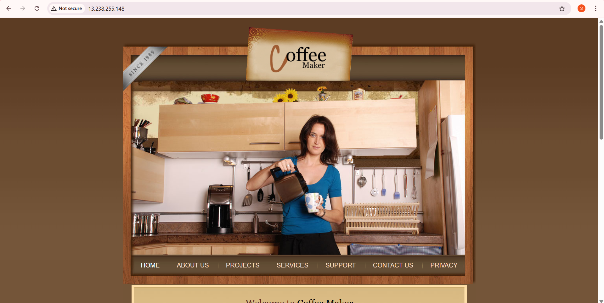
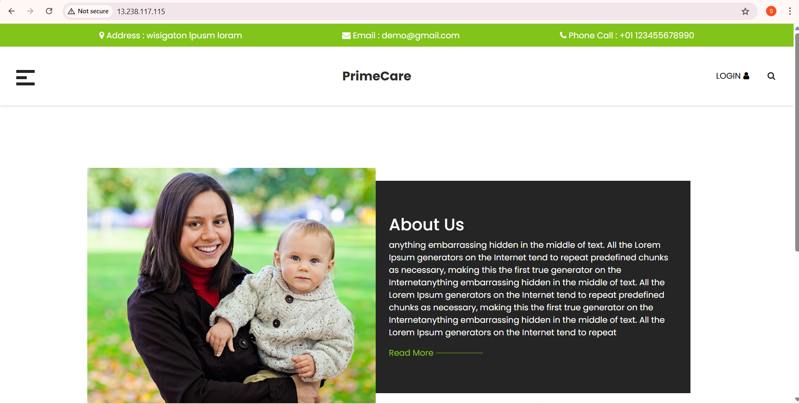
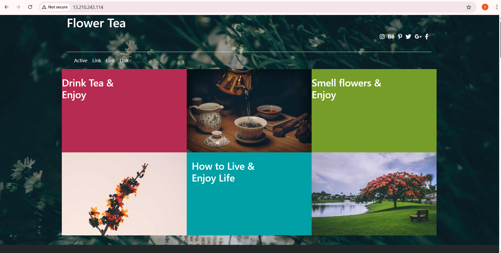

# Static Website Deployment on EC2 (Nginx web server)


# Deployment on Ubuntu (Nginx)

## 1. Launch EC2 (Ubuntu)

## 2. Install Nginx
```bash
sudo apt update
sudo apt install nginx -y
systemctl start nginx
systemctl enable nginx
systemctl status nginx
```
---

## 3. Clone Repository
```bash
cd /var/www/html
git clone https://github.com/shwetabhore18/staticwebsite-templates.git
```
---

## 4. Move Website Files
```bash
sudo rm defualt .html file
sudo mv -r staticwebsite-templates/coffee/* /var/www/html/
```

## 5. Restart Nginx
```bash
sudo systemctl restart nginx
copy public ip and check on browser
```

---

## NOTE:

Ubuntu default root for **Nginx** is `/var/www/html`.

Although Nginx also has `/usr/share/nginx/html`,  
**but Ubuntu (apt install nginx)** uses `/var/www/html`.
depending on the installation for apt install nginx is `/var/www/html`.

If you want to **change the root location**, edit:

```bash
sudo vim /etc/nginx/sites-available/default
```

Then change:

```bash
root /usr/share/nginx/html;
```

## Website Output Screenshot




---

# Deployment on Amazon Linux (Nginx)

## 1. Launch EC2 (Amazon Linux)

## 2. Install Nginx

### Amazon Linux 

```bash
sudo yum update -y
sudo yum install nginx -y
sudo systemctl start nginx
sudo systemctl enable nginx
sudo systemctl status nginx
```

## 3. Default Nginx Root Directory

On Amazon Linux, the default root directory is:

`/usr/share/nginx/html`

---

## 4. Deploy Website

```bash
cd ~
git clone https://github.com/shwetabhore18/staticwebsite-templates.git
```

Remove default Nginx files:

```bash
sudo rm -rf /usr/share/nginx/html/*
```

Copy website files (example: coffee template):

```bash
you have to present in the root directory
sudo cp -r /staticwebsite-templates/yoga/* /usr/share/nginx/html/
sudo systemctl restart nginx
OR 
cd /usr/share/nginx/html/
cp -r ~/staticwebsite-templates/yoga/* .
```

## Website Output Screenshot

Now open your EC2 Public IP in browser.


---

# 🖥️ Deployment on Apache WebServer using Ubuntu

## 1. Launch EC2 (Ubuntu)

## 2. Install Apache

```bash
sudo apt update
sudo apt install apache2 -y
sudo systemctl start apache2
sudo systemctl enable apache2
sudo systemctl status apache2
check using public Ip 'it will show default apache page'
```

---

## 3. Default Root Directory (Apache -> Ubuntu)

Apache default root directory on Ubuntu:

`/var/www/html`

Apache Package name on Ubuntu:

`apache2`

---

## 3. Deploy Website

Clone repository:

```bash
cd ~
git clone https://github.com/shwetabhore18/staticwebsite-templates.git
```

Remove default Apache page:

```bash
sudo rm -rf /var/www/html/*
```

Copy website files (example: medical template):

```bash
sudo cp -r ~/staticwebsite-templates/medical/* /var/www/html/
```

Restart Apache:

```bash
sudo systemctl restart apache2
```
Now open your EC2 Public IP in the browser.



---

# 🖥️ Deployment on Apache WebServer using Amazon Linux

## 📌 Prerequisites

- Amazon Linux EC2 Instance
- Security Group allowing HTTP (Port 80)
- Git installed if not 
- yum install git

---

## 1. Launch EC2 (Amazon Linux)

## 2: Install Apache (httpd)

```bash
sudo yum update -y
sudo yum install httpd -y
```

Start and enable Apache:

```bash
sudo systemctl start httpd
sudo systemctl enable httpd
sudo systemctl status httpd
```

---

## 3: Install Git (if not installed)

```bash
sudo yum install git -y
```

---

## 4. Default Root Directory (Apache -> Amazon Linux)

Apache default root directory on Amazon Linux:

`/var/www/html`

Apache Package name on Amazon Linux:

`httpd`

---

## 5: Clone Repository

```bash
cd ~
git clone https://github.com/shwetabhore18/staticwebsite-templates.git
```

---

## 6: Remove Default Apache Files

```bash
sudo rm -rf /var/www/html/*
```

---

## 7: Deploy Website Files

Example: Tea Template

```bash
sudo cp -r ~/staticwebsite-templates/tea/* /var/www/html/
```

---

## 8: Restart Apache

```bash
sudo systemctl restart httpd
```

---
Now open your EC2 Public IP in the browser.

---

## Website Output Screenshot

Now open your EC2 Public IP in browser.



---
## NOTE:
## 📝 Service Name Difference

| Operating System | Apache Service Name |
|------------------|--------------------|
| Ubuntu           | `apache2`          |
| Amazon Linux     | `httpd`            |

```bash
default root directory for both is -> **/var/www/html/**
```